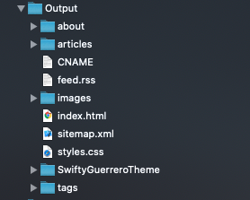

# CNAME plugin for Publish 🚀

<p align="center">
    <a href="https://github.com/SwiftyGuerrero/CNAMEPublishPlugin/workflows/Build/badge.svg">
        
    </a>
    <a href="https://swift.org/">
        
    </a>
	<a href="https://swift.org/package-manager/">
		
	</a>
    
    <a href="https://twitter.com/SwiftyGuerrero">
        
    </a>
</p>

----------------

A [Publish](https://github.com/johnsundell/publish) plugin that generates a custom domain name file for any Publish website deployed to GitHub.

## Table of Contents

- [Background](#background)
- [Install](#install)
- [Usage](#usage)
- [Contribute](#contribute)

## Background

When developing your own static website and deploying to GitHub Pages, you will most likely  want to have your own custom domain. This requires having
a custom domain name file, also known as a `CNAME` in the root directory of your website or the GitHub repository that your website is hosted on. When generating your site and pushing to GitHub, the `CNAME` file is removed since [Publish](https://github.com/johnsundell/publish) will always push whatever files are generated in the dedicated `Output` directory. This plugin aims to generate a `CNAME`
file into the `Output` directory that [Publish](https://github.com/johnsundell/publish) uses for deploying your site to GitHub.

## Install

To install it into your [Publish](https://github.com/johnsundell/publish) package, add it as a dependency within your `Package.swift` manifest:
```swift
let package = Package(
    ...
    dependencies: [
        ...
        .package(name: "CNAMEPublishPlugin", url: "https://github.com/SwiftyGuerrero/CNAMEPublishPlugin", from: "0.1.0")
    ],
    targets: [
        .target(
            ...
            dependencies: [
                ...
                "CNAMEPublishPlugin"
            ]
        )
    ]
    ...
)
```

## Usage

In the file where you declare your [Publish](https://github.com/johnsundell/publish) deployment pipeline,
import `CNAMEPublishPlugin`:
```swift
import CNAMEPublishPlugin
```

The plugin can be installed at any point in the publishing pipeline, but before the deploy step:
```swift
import CNAMEPublishPlugin

...
try Website().publish(using: [
    ...
    .installPlugin(.generateCNAME(with: "test.io", "www.test.io")),
    .deploy(using: .gitHub("TestUser/TestUser.github.io"))
])
```

You can also add a `CNAME` to the `Resources` directory of your website and then use the `addCNAME` plugin to copy
the `CNAME` to the output directory:
```swift
import CNAMEPublishPlugin

...
try Website().publish(using: [
    ...
    .installPlugin(.addCNAME()),
    .deploy(using: .gitHub("TestUser/TestUser.github.io"))
])
```

To verify that the file is generated and in the `Output` directory, you can use the `publish run` command to test
publishing your site locally. Then in the created `Output` directory, you will see the generated `CNAME` as shown
below:
<p align="left">
    
</p>

To learn more about custom domains for GitHub Pages, visit GitHub's [documentation](https://help.github.com/en/github/working-with-github-pages/managing-a-custom-domain-for-your-github-pages-site) related to managing your own custom domain.

## Contribute

CNAMEPublishPlugin is developed completely in the open, and your contributions are more than welcome.

Before getting started, spend some time checking the internal implementation and documentation so you'll be ready to tackle any issues or edge cases that you might encounter.

This project does not come with GitHub Issues-based support, and users are instead encouraged to become active participants in its continued development — by fixing any bugs that they encounter, or by improving the documentation wherever it’s found to be lacking.

Thank you and enjoy :100:
